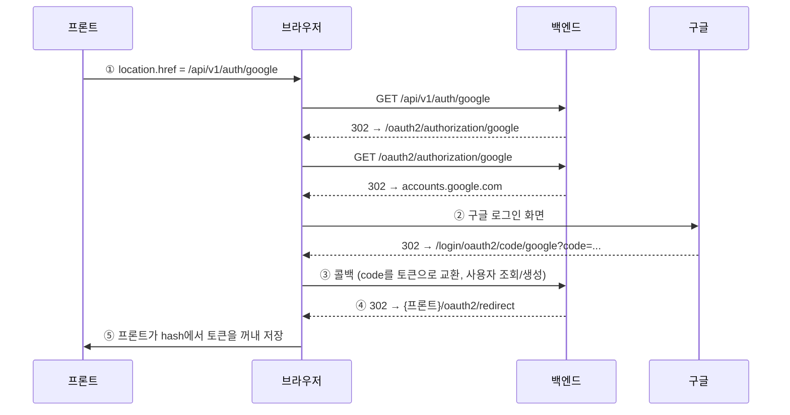

# 구글 로그인 API

> 대상 독자: 프론트엔드 개발자
> 최종 수정: 2026-08-10

## 개요

브라우저 리다이렉트 방식(OAuth 2.0 Authorization Code)입니다.

프론트는 진입점 하나로 사용자를 보내기만 하면 되고, 로그인이 끝나면 지정된 프론트 주소로
**URL 프래그먼트(`#`)에 토큰이 실려** 돌아옵니다.

이후 모든 API 호출은 `Authorization: Bearer {accessToken}` 헤더로 인증합니다.
쿠키를 사용하지 않으므로 프론트가 토큰을 직접 저장하고 첨부해야 합니다.

---

## 전체 흐름



| 단계 | 내용 | 담당 |
|---|---|---|
| ① | 로그인 시작 | **프론트** |
| ② | 구글 계정 선택·동의 | 사용자 |
| ③ | 콜백 처리, 사용자 조회/생성 | 백엔드 (자동) |
| ④ | 토큰을 붙여 프론트로 리다이렉트 | 백엔드 (자동) |
| ⑤ | 토큰 파싱·저장 | **프론트** |

프론트가 코드를 작성해야 하는 구간은 **① 과 ⑤ 두 곳뿐**입니다.
②~④는 브라우저가 리다이렉트를 따라가며 자동으로 진행됩니다.

---

## ① 로그인 시작

```
GET /api/v1/auth/google
```

| 항목 | 값 |
|---|---|
| 인증 | 불필요 |
| 요청 파라미터 | 없음 |
| 요청 본문 | 없음 |
| 응답 | `302 Found` (`Location: /oauth2/authorization/google`) |

```js
// 로그인 버튼
function loginWithGoogle() {
  window.location.href = `${API_BASE_URL}/api/v1/auth/google`;
}
```

> ⚠️ **`fetch` / `axios` 로 호출하면 안 됩니다.**
> 302를 따라가다 `accounts.google.com` 에서 CORS로 차단됩니다.
> 반드시 `window.location.href` 로 **페이지 이동**시켜야 합니다.
>
> 같은 이유로 Swagger UI의 "Try it out" 으로도 테스트할 수 없습니다.
> 브라우저 주소창에 직접 입력해 확인하세요.

---

## ⑤ 토큰 수신

로그인이 성공하면 아래 주소로 리다이렉트됩니다.

```
{REDIRECT_URI}#accessToken={JWT}&refreshToken={JWT}
```

`REDIRECT_URI` 는 환경별 설정값입니다.

| 환경 | 값 |
|---|---|
| 로컬 | `http://localhost:3000/oauth2/redirect` |
| 운영 | 배포 시 확정 |

실제 예시 (토큰은 중략):

```
http://localhost:3000/oauth2/redirect
  #accessToken=eyJhbGciOiJIUzI1NiJ9.eyJjYXRlZ29yeSI6ImFjY2VzcyIs...
  &refreshToken=eyJhbGciOiJIUzI1NiJ9.eyJjYXRlZ29yeSI6InJlZnJlc2gi...
```

### 처리 코드

```js
// /oauth2/redirect 라우트에서 실행
function handleOAuthRedirect() {
  const params = new URLSearchParams(window.location.hash.slice(1)); // '#' 제거 후 파싱

  const accessToken  = params.get('accessToken');
  const refreshToken = params.get('refreshToken');

  if (!accessToken) {
    // 로그인 실패 또는 직접 접근
    return redirectTo('/login');
  }

  saveTokens(accessToken, refreshToken);

  // 주소창과 히스토리에서 토큰 제거 (뒤로가기로도 복원되지 않음)
  history.replaceState(null, '', '/');

  redirectTo('/');
}
```

### 왜 `?` 가 아니라 `#` 인가

프래그먼트(`#` 뒤)는 브라우저가 HTTP 요청에 포함하지 않습니다. 따라서 토큰이

- 웹서버 액세스 로그
- `Referer` 헤더 (외부 스크립트·CDN·링크 클릭 시 유출)
- 프록시 / CDN 로그

어디에도 남지 않습니다. 쿼리스트링(`?`)을 쓰면 위 세 곳에 모두 평문으로 기록됩니다.

주소창과 브라우저 히스토리에는 남으므로, **토큰을 꺼낸 즉시 `history.replaceState` 로 지워야 합니다.**

---

## 토큰 사양

| 항목 | accessToken | refreshToken |
|---|---|---|
| 만료 | **10분** | **24시간** |
| 용도 | API 호출 인증 | 재발급 전용 |
| 전달 방식 | `Authorization: Bearer {값}` | 요청 본문 |
| 서버 보관 | 안 함 | DB에 저장 |

- 두 토큰의 `sub`(subject)는 사용자의 **publicId(UUID)** 입니다.
  순번 ID를 쓰면 다른 사용자의 식별자를 추측할 수 있어 사용하지 않습니다.
- accessToken은 서버가 취소할 수 없습니다. 로그아웃해도 **최대 10분간 유효**하므로
  프론트도 저장소에서 반드시 삭제해야 합니다.
- refreshToken은 재발급 시 **새 값으로 교체(Rotation)** 됩니다. 응답으로 받은 값을 갱신 저장하세요.

### 이후 API 호출

```js
fetch(`${API_BASE_URL}/api/me`, {
  headers: { Authorization: `Bearer ${accessToken}` }
});
```

| 응답 | 본문 | 대응 |
|---|---|---|
| 200 | 정상 데이터 | — |
| 401 | `{"error":"unauthorized"}` | 헤더 누락 → 로그인 화면으로 |
| 401 | `access token expired` | 재발급 후 원래 요청 재시도 |
| 401 | `invalid access token` | refreshToken을 잘못 넣은 경우 |

### 재발급

```
POST /api/v1/auth/reissue
Content-Type: application/json

{ "refreshToken": "..." }
```

```json
{ "accessToken": "...", "refreshToken": "..." }
```

| 코드 | 본문 | 원인 |
|---|---|---|
| 400 | `refresh token null` | 필드 누락 |
| 401 | `refresh token expired` | 24시간 경과 → 재로그인 |
| 401 | `invalid refresh token` | accessToken을 넣음 / 로그아웃됨 / 이미 사용됨 |

### 로그아웃

```
POST /api/v1/auth/logout
Content-Type: application/json

{ "refreshToken": "..." }
```

`200 OK`, 본문 없음. 서버는 refreshToken을 DB에서 삭제해 재발급을 막습니다.
**프론트도 저장소의 두 토큰을 모두 삭제해야 합니다.**

---

## 사용자 생성

처음 로그인하는 사용자는 ③ 단계에서 자동으로 생성됩니다.

- 식별 기준: `(소셜 종류 = Google, 소셜 ID = 구글이 발급한 sub)`
- 생성되는 데이터: 계정 / 소셜 연동 정보 / 프로필(이름·이메일) 세 가지
- 이름과 이메일은 구글 계정에서 가져오며, 마이페이지에서 수정할 수 없습니다
- **기존 사용자와 응답 형태가 완전히 동일합니다** (아래 미정 항목 참고)

---

## 미정 항목

명세 확정 전에 결정이 필요한 두 가지입니다.

### 1. 신규 가입자 구분

현재는 첫 로그인과 재로그인의 응답이 동일해서, 프론트가 온보딩 화면(닉네임 설정 등)으로
보낼지 판단할 근거가 없습니다.

- **방안 A** — 리다이렉트 URL에 `&isNewUser=true` 추가
- **방안 B** — 로그인 후 `GET /api/me` 를 호출해 `nickname == null` 로 판단 (추가 구현 불필요)

### 2. 로그인 실패 처리

사용자가 구글 동의 화면에서 취소하면 현재는 백엔드 기본 경로(`/login?error`)로 이동해
프론트로 돌아오지 않습니다.

- **방안** — 실패 시 `{REDIRECT_URI}?error=access_denied` 로 보내도록 추가

---

## 환경 설정 (백엔드)

배포 환경마다 아래 값을 맞춰야 합니다.

| 설정 키 | 설명 |
|---|---|
| `app.frontend-origin` | 프론트 주소. CORS 허용 오리진 |
| `app.oauth2.redirect-uri` | 로그인 후 토큰을 실어 보낼 프론트 주소 |
| `spring.security.oauth2.client.registration.google.client-id` | 구글 클라이언트 ID |
| `spring.security.oauth2.client.registration.google.client-secret` | 구글 클라이언트 시크릿 |

구글 클라우드 콘솔의 **승인된 리디렉션 URI** 에는 아래 주소가 등록되어 있어야 합니다.
(위 `app.oauth2.redirect-uri` 와는 다른 값이니 혼동하지 마세요.)

```
{백엔드 주소}/login/oauth2/code/google
```
